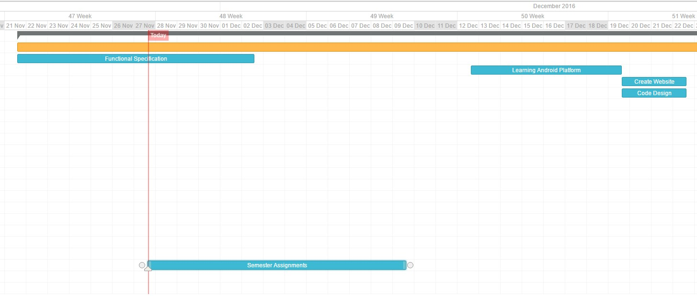
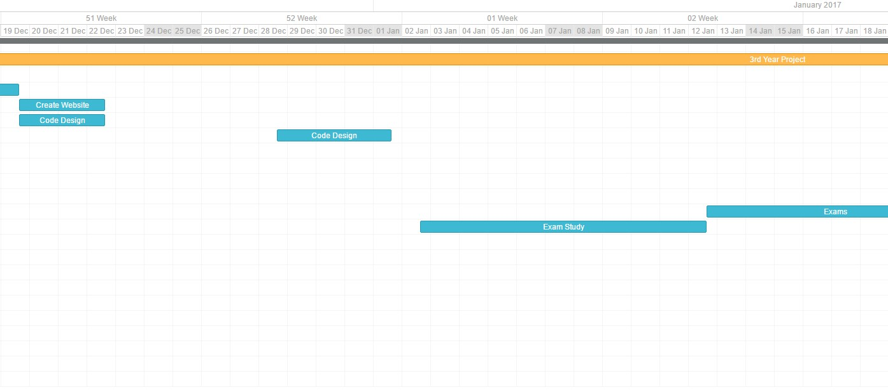
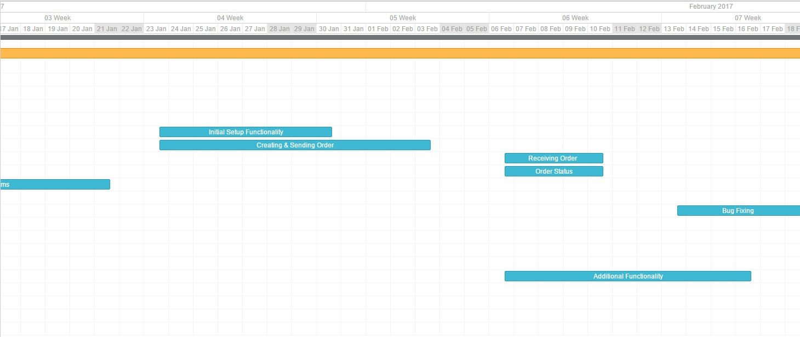
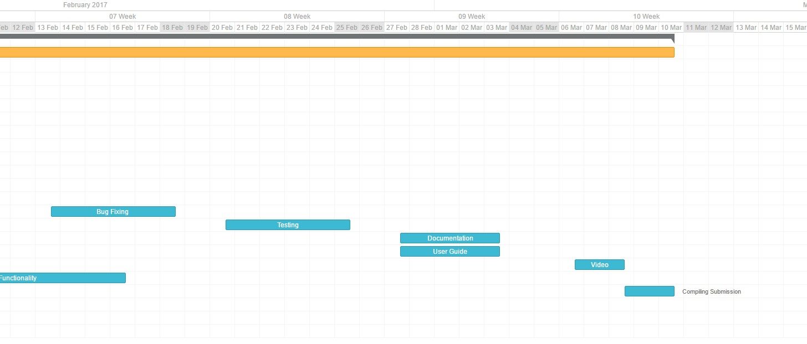

# 3rd Year Project Functional Specification

|                   |                    |
|:----------------:|:--------------------:|
| Date:             | 30th November 2016 |
| Student Names:    | Finnian O’Neill  Ian Kelly |
| Lecturer:         | Dr.David Sinclair |
| Topics:           | 1. Introduction.  2. General Description  3. Functional Requirements  4. System Architecture  5.High-Level Design   6. Preliminary Schedule  7. Appendix |

We declare that this material, which We now submit for assessment, is entirely our own work and has not been taken from the work of others, save and to the extent that such work has been cited and acknowledged within the text of my/our work. We understand that plagiarism, collusion, and copying are grave and serious offences in the university and accept the penalties that would be imposed should we engage in plagiarism, collusion or copying. We have read and understood the Assignment Regulations. We have identified and included the source of all facts, ideas, opinions, and viewpoints of others in the assignment references. Direct quotations from books, journal articles, internet sources, module text, or any other source whatsoever are acknowledged and the source cited are identified in the assignment references. This assignment, or any part of it, has not been previously submitted by us or any other person for assessment on this or any other course of study. We have read and understood the referencing guidelines found at: http://www.dcu.ie/info/regulations/plagiarism.shtml 

-------------------------------------------------------------------------------

## Introduction

### Overview

For our project we are going to design and develop a Point of Sale application aimed at small to medium businesses. We see a need for our app as many businesses are beginning to use tablets as a replacement for their tills as they are more cost effective in comparison to regular tills that require a great deal of setup with little reward. 

We aim to design a point of sale application that will be targeted specifically at Bars, Resturants and Cafes so that we can increase efficency and productivity during service as we feel current solutions don't allow you to tailor your POS deivce to the needs of your business. 

Our application will be designed for the Android platform and it will allow a waitor/waitress to take an order on her android phone, then once she's finished taking the order it will be divided up and sent to various parts of the resturant, i.e. The drinks will be sent to the Bar and the food will be sent to the kitchen.  

### Business Context

The aim for this project is to replace current POS services with something that is tailored to the needs of your business allowing for a more efficent and productive service which in turn should increase sales.  

### Glossary

P.O.S - Point of Sale/Service 

-------------------------------------------------------------------------------

## General Description

### Product / System Functions

* Describes the general functionality of the system / product.

Lorem ipsum dolor sit amet, et omnium voluptua nam, ad nonumy iuvaret quo, aeque appareat et sea. Everti urbanitas no per. Ne ius tantas nostro definitiones, mollis maluisset eam at, copiosae adipiscing ad eos. Nec no natum iuvaret alterum, veri magna liber quo te. 

### User Characteristics and Objectives

* Describes the features of the user community, including their expected expertise with software systems and the application domain. Explain the objectives and requirements for the system from the user's perspective. It may include a "wish list" of desirable characteristics, along with more feasible solutions that are in line with the business objectives.

Lorem ipsum dolor sit amet, et omnium voluptua nam, ad nonumy iuvaret quo, aeque appareat et sea. Everti urbanitas no per. Ne ius tantas nostro definitiones, mollis maluisset eam at, copiosae adipiscing ad eos. Nec no natum iuvaret alterum, veri magna liber quo te. 

### Operational Scenarios

* This section should describe a set of scenarios that illustrate, from the user's perspective, what will be experienced when utilizing the system under various situations.

Lorem ipsum dolor sit amet, et omnium voluptua nam, ad nonumy iuvaret quo, aeque appareat et sea. Everti urbanitas no per. Ne ius tantas nostro definitiones, mollis maluisset eam at, copiosae adipiscing ad eos. Nec no natum iuvaret alterum, veri magna liber quo te. 

### Constraints

* Lists general constraints placed upon the design team, including speed requirements, industry protocols, hardware platforms, and so forth.

Lorem ipsum dolor sit amet, et omnium voluptua nam, ad nonumy iuvaret quo, aeque appareat et sea. Everti urbanitas no per. Ne ius tantas nostro definitiones, mollis maluisset eam at, copiosae adipiscing ad eos. Nec no natum iuvaret alterum, veri magna liber quo te. 

-------------------------------------------------------------------------------

## Functional Requirements

### Registration

#### Description
The user should be able to create a Menu, add Employee's(and generate Logins for each), create a table map, setup a roster and select a LAN network all through our website.

#### Criticality
This is a vital part of the system as it is the inital one time setup to start the system.

#### Technical issues
One implemetation issue could be getting hold of a server to be able to run the application.

Also selecting the LAN network as if the user is not on the network they want the application to run on, they will have to add it to their inital setup which could be confusing for users who are not tech savvy.

#### Dependencies with other requirements
This function does not rely on any other functions.

### Inital Setup

#### Description
The first time a user downloads the andoid application they will be required to login and must be on the selected LAN network, after which a local copy of all the required files will be created. 

#### Criticality
This is a vital part of the system as it will double as the security restrictions for use of the application and also it will allow for offline functinality.

#### Technical issues
One issue could be that for a medium business the local copy of the required files could be large and may be an isuue for some users. 

#### Dependencies with other requirements
This function will rely on the registration requirment as it will have to find which account the login is related to. 

### Daily inital connection

#### Description
If an employee leaves or quits they will need to be taken off the system to ensure they still can't create orders,if there is an update to the menu or if there is a change to the table map. So a small sync the first time you connect to the LAN each day it will check for any changes made to the system and update. This will also be possible thorugh an update button.

#### Criticality
This is a will be a necessary function to allow changes to be made without affecting service.

#### Technical issues
One issue could be that some android devices only connect to LAN networks once they're awake and could mean that a user may have to wait if a significant amount of changes were made to the system.

#### Dependencies with other requirements
This function will rely on the registration requirment as it will have to find which account the login is related to and if any changes were made to that account. 

### Sending an Order

#### Description
A waitress/waitor will take down an order and send it off to be made, the order will be split up and sent to various locations.

#### Criticality
This will be a vital function for the application as it is one of our main selling points.

#### Technical issues
An issues that may arise with sending an order would be if menu items aren't catagorised correctly and as a result may not arrive to the intended location.

#### Dependencies with other requirements
This function will rely on the local copy of files being up to date (intial daily connection) so all orders are distrubted correctly.

### Recieving an Order

#### Description
After an order is sent, it is split up and sent to various locations. With Food items being sent to the kitchen and Drink Items being sent to the Bar.

#### Criticality
This will be a vital function for the application as it is one of our main selling points.

#### Technical issues
An issue may arise if a device is asleep or on standby as the user may not hear the alert.

#### Dependencies with other requirements
This function will rely Sending an order.

### Order Status

#### Description
While an order is being prepared a user will be able to look at the table map and see the status of each order at a glance as each table will be highlighted green for order ready, orange for waiting for order and red for not ordered.

#### Criticality
This will be a vital function for the application as it is one of our main selling points.

#### Technical issues
If orders aren't sent to the correct location then a table may be left with the orange status.

#### Dependencies with other requirements
This function will rely Sending an order and Recieving an Order to determind the status of each order.

-------------------------------------------------------------------------------

## System Architecture

* This section describes a high-level overview of the anticipated system architecture showing the distribution functions across (potential) system modules. Architectural components that are reused or 3rd party should be highlighted.

Lorem ipsum dolor sit amet, et omnium voluptua nam, ad nonumy iuvaret quo, aeque appareat et sea. Everti urbanitas no per. Ne ius tantas nostro definitiones, mollis maluisset eam at, copiosae adipiscing ad eos. Nec no natum iuvaret alterum, veri magna liber quo te. Eu vel porro evertitur dissentiet.Lorem ipsum dolor sit amet, et omnium voluptua nam, ad nonumy iuvaret quo, aeque appareat et sea. Everti urbanitas no per. Ne ius tantas nostro definitiones, mollis maluisset eam at, copiosae adipiscing ad eos. Nec no natum iuvaret alterum, veri magna liber quo te. Eu vel porro evertitur dissentiet.

-------------------------------------------------------------------------------

## High-Level Design

* This section should set out the high-level design of the system. It should include one or more system models showing the relationship between system components and the systems and its environment. These might be object-models, DFD, etc.

Lorem ipsum dolor sit amet, et omnium voluptua nam, ad nonumy iuvaret quo, aeque appareat et sea. Everti urbanitas no per. Ne ius tantas nostro definitiones, mollis maluisset eam at, copiosae adipiscing ad eos. Nec no natum iuvaret alterum, veri magna liber quo te. Eu vel porro evertitur dissentiet.Lorem ipsum dolor sit amet, et omnium voluptua nam, ad nonumy iuvaret quo, aeque appareat et sea. Everti urbanitas no per. Ne ius tantas nostro definitiones, mollis maluisset eam at, copiosae adipiscing ad eos. Nec no natum iuvaret alterum, veri magna liber quo te. Eu vel porro evertitur dissentiet.

-------------------------------------------------------------------------------

## Preliminary Schedule

| Task Name | Start Date | End Date |
| --------- | ---------- | -------- |
| Funtional Specification | 21/11/16 | 02/12/16 |
| Semester Assignments | 27/11/16 | 09/12/16 |
| Learning Android Platform | 12/12/16 | 19/12/16 |
| Create Registration Website | 19/12/16 | 22/12/16 |
| Code Design | 19/12/16 | 22/12/16 |

| Task Name | Start Date | End Date |
| --------- | ---------- | -------- |
| Code Design | 28/12/16 | 01/01/17 |
| Exam Study | 02/01/17 | 12/01/17 |
| Exams | 12/01/17 | 21/01/17 |

| Task Name | Start Date | End Date |
| --------- | ---------- | -------- |
| Initial Setup Functionality | 23/01/17 | 30/01/17 |
| Creating & Sending Order | 23/01/17 | 03/02/17 |
| Recieving Order | 06/02/17 | 10/01/17 |
| Order Status | 06/02/17 | 10/01/17 |
| Additional Funcationality | 06/02/17 | 16/02/17 |
| Bug Fixing | 13/02/17 | 18/02/17 |

| Task Name | Start Date | End Date |
| --------- | ---------- | -------- |
| Testing | 20/02/17 | 25/02/17 |
| Documentation | 27/02/17 | 03/03/17 |
| User Guide | 27/02/17 | 03/03/17 |
| Video | 06/03/17 | 08/03/17 |
| Compiling Submission | 08/03/17 | 10/03/17 |

-------------------------------------------------------------------------------

## Appendix

* other useful information for understanding the requirements. 

Lorem ipsum dolor sit amet, et omnium voluptua nam, ad nonumy iuvaret quo, aeque appareat et sea. Everti urbanitas no per. Ne ius tantas nostro definitiones, mollis maluisset eam at, copiosae adipiscing ad eos. Nec no natum iuvaret alterum, veri magna liber quo te. Eu vel porro evertitur dissentiet.Lorem ipsum dolor sit amet, et omnium voluptua nam, ad nonumy iuvaret quo, aeque appareat et sea. Everti urbanitas no per. Ne ius tantas nostro definitiones, mollis maluisset eam at, copiosae adipiscing ad eos. Nec no natum iuvaret alterum, veri magna liber quo te. Eu vel porro evertitur dissentiet.

-------------------------------------------------------------------------------
